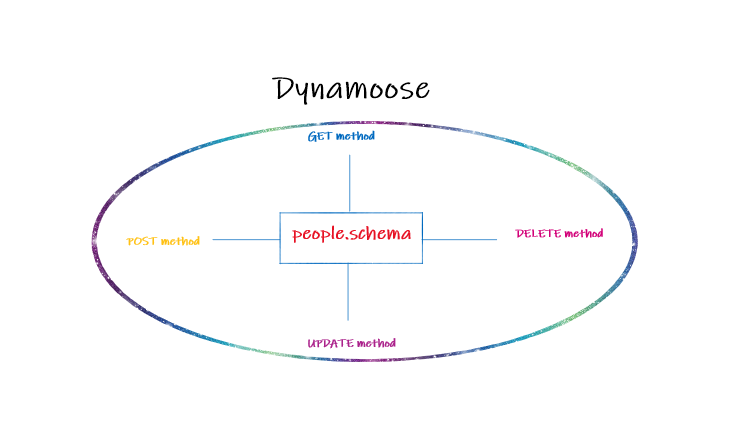

# serverless-api

### What is the root URL to your API?

https://08l2a4yhml.execute-api.us-east-1.amazonaws.com/people

### What are the routes?

**Routes:**

- POST method --> /people
- GET method --> /people
- GET method by id --> /people/{id}
- UPDATE method --> /people/{id}
- DELETE method --> /people/{id}

### What inputs do they require?

- POST method --> requires body 
- GET method --> Nth
- GET method by id --> requires id 
- UPDATE method --> requires id and body 
- DELETE method --> requires id 

### What output do they return?

- POST method --> add new obeject
- GET method --> array with all object
- GET method by id --> one object that matching with id
- UPDATE method --> update the object that match with id
- DELETE method --> retutn emty object 

### UML

